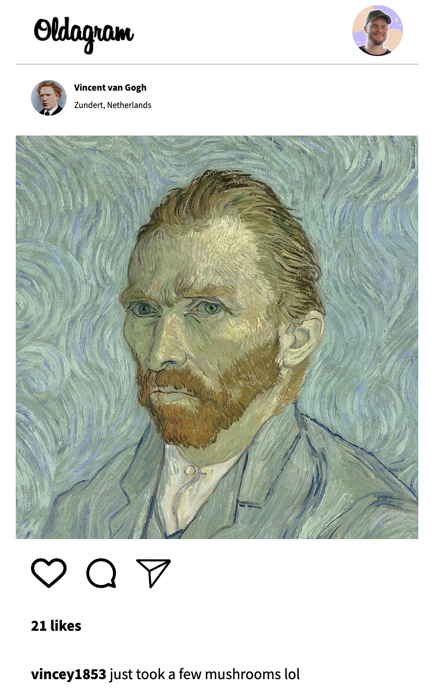

<h1 align="center">{ 🗺️ Oldagram 📸}</h1>

  <h3>
    <a href="https://oldagram-insta-copy.netlify.app/">
      Demo Site
    </a>
     
  </h3>

 

 

## Basic Instagram Copy

 

 

## Features

- Posts rendered dynamicall with JS
- Click & DoubleClick event handlers for heart icon and main post image to increase number of likes when clicked / double clicked and reduce number of likes when clicked / double clicked again
- toggle filled heart icon shown when liked via CSS and JS class added and removed when clicked / double clicked again.

 

website - [Mo Khaife](https://mo-khaife-ali.netlify.app/)

Twitter - [@khaife_codes](https://twitter.com/Khaife_Codes)
